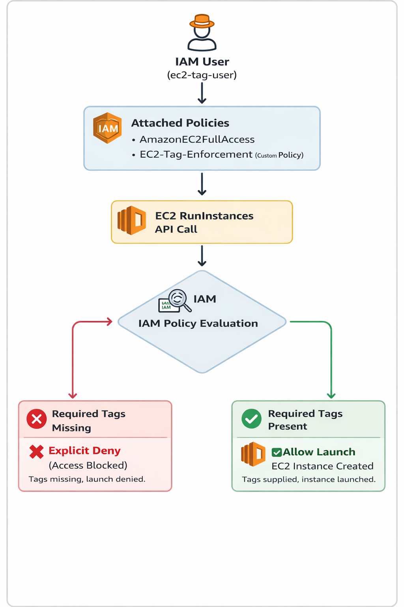
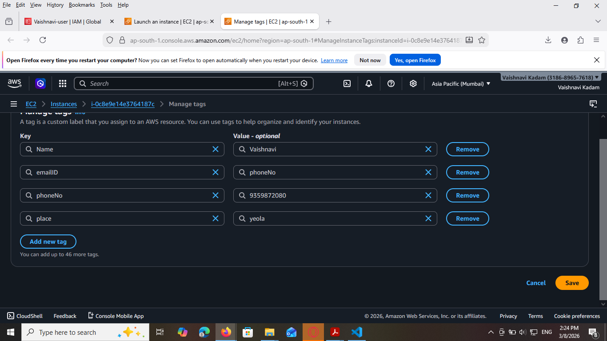
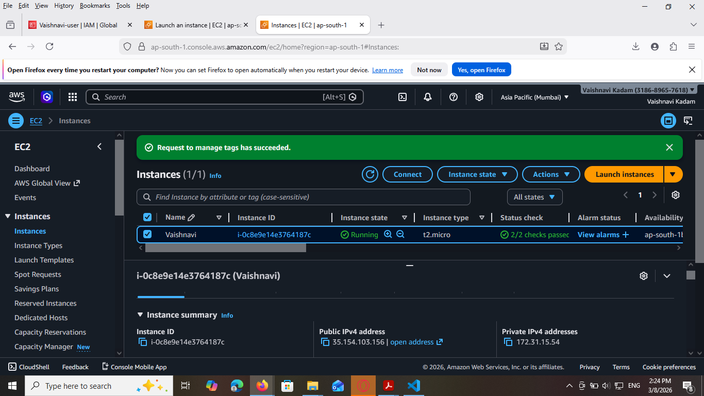
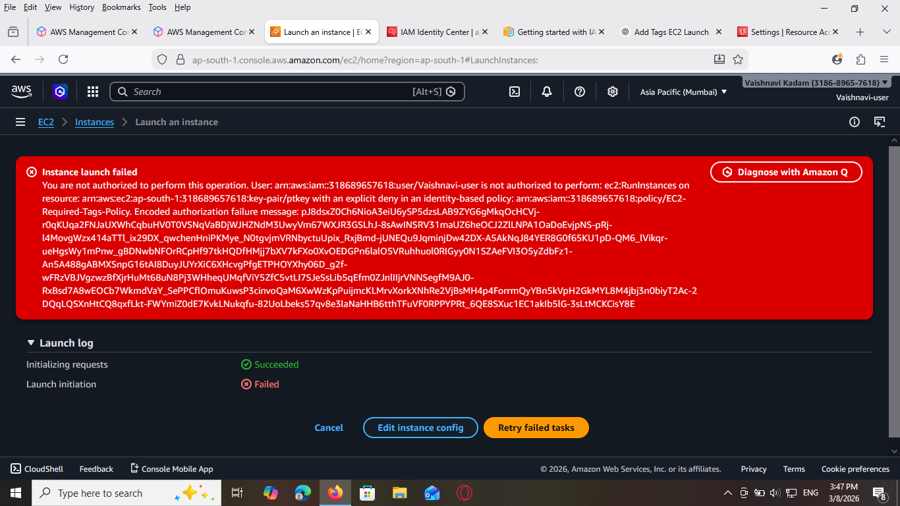

# EC2 Instance Launch with Enforced Tagging Policy Using AWS Tag Policies

## Project Title
EC2 Instance Launch with Enforced Tagging Policy Using AWS Tag Policies

## Objective
The objective of this project is to implement tagging best practices in AWS by enforcing mandatory tags during the creation of EC2 instances. This ensures better resource management, accountability, and cost tracking within an organization.

This project demonstrates how an EC2 instance can only be launched when required tags are provided. If the required tags are missing, the system denies the request.

---

## AWS Services Used
- Amazon EC2
- AWS IAM
- AWS Organizations (Optional)
- AWS Tag Policies

---

## Required Tags

Every EC2 instance must include the following tags during launch.

| Tag Key | Example Value |
|--------|---------------|
| Name | Vaishnavi |
| emailID | vaishnavikadam8153@gmail.com |
| phoneNo | 9359872080 |
| Place | Pune |

These tags help identify the owner and purpose of the AWS resource.

---

## Project Architecture



User → AWS Console / CLI → IAM Policy Enforcement → EC2 Instance Launch

If required tags are missing, the request will be denied.

---

# Implementation Steps

## Step 1: Login to AWS Console
1. Open AWS Management Console
2. Navigate to **IAM Service**
3. Create a policy to enforce tagging rules.

---

## Step 2: Create IAM Policy for Tag Enforcement

Go to IAM → Policies → Create Policy → JSON

Example Policy:

```json
{
  "Version": "2012-10-17",
  "Statement": [
    {
      "Effect": "Deny",
      "Action": "ec2:RunInstances",
      "Resource": "*",
      "Condition": {
        "Null": {
          "aws:RequestTag/Name": "true",
          "aws:RequestTag/emailID": "true",
          "aws:RequestTag/phoneNo": "true",
          "aws:RequestTag/Place": "true"
        }
      }
    }
  ]
}
```

This policy prevents launching EC2 instances if the required tags are not provided.

---

## Step 3: Attach Policy to User or Role

1. Go to IAM
2. Select **Users**
3. Choose the user
4. Click **Add Permissions**
5. Attach the created policy

---

## Step 4: Launch EC2 Instance With Required Tags

1. Go to EC2 Dashboard
2. Click **Launch Instance**
3. Select AMI (Amazon Linux recommended)
4. Choose instance type (t2.micro)
5. Scroll to **Tags section**
6. Add required tags

Example:

| Key | Value |
|----|------|
| Name | Vaishnavi |
| emailID | vaishnavikadam8153@gmail.com |
| phoneNo | 9359872080 |
| Place | Pune |

7. Click **Launch Instance**

Result:  
The instance launches successfully.

---

## Step 5: Test Launch Without Tags

1. Launch another EC2 instance
2. Do NOT add required tags
3. Click **Launch Instance**

Expected Result:

The instance creation fails with an error message such as:

```
You are not authorized to perform this operation because required tag keys are missing.
```

---

# Testing and Validation

## Test Case 1: Launch with Tags

Action:
Launch EC2 instance with all required tags.

Result:
Instance created successfully.

Screenshot Required:
EC2 instance running with tags.

---

## Test Case 2: Launch without Tags

Action:
Launch EC2 instance without tags.

Result:
Request denied due to missing tags.

Screenshot Required:
Error message displayed.

---

# Screenshots Required for Submission
---
1. IAM Policy Creation


---
2. Policy Attached to User


---
3. EC2 Launch Page with Tags


---
4. EC2 Instance Running


---
5. Error Message when launching without tags




---

# Benefits of Tagging

Tagging helps in:

- Resource Identification
- Cost Management
- Security and Governance
- Resource Grouping
- Automation and Monitoring

---

# Conclusion

In this project, we implemented a tagging enforcement mechanism using IAM policies in AWS. The policy ensures that EC2 instances cannot be launched without mandatory tags. This approach helps organizations maintain proper governance and track resources efficiently.

Tag policies improve cloud resource management and enforce accountability among users.

---

# Author

Vaishnavi Kadam  
DevOps / Cloud Enthusiast

Github :
https://github.com/vaishnavikadam1918

LinkedIn :
 https://www.linkedin.com/in/vaishnavi-kadam-206207311

Email : vaishnavikadam8153@gmail.com

---